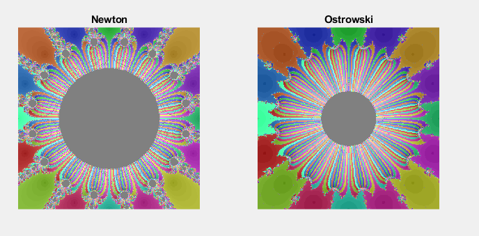

# MATLAB-Visualise-Ostrowski-vs-Newton
Matlab file to run a simulation to visualise the roots for a given equation using both the Newton method and the Ostrowski method

using OstrowskivsNewton(@(x) x^16 - 1, @(x) 16*x^15, 400) should give you:

